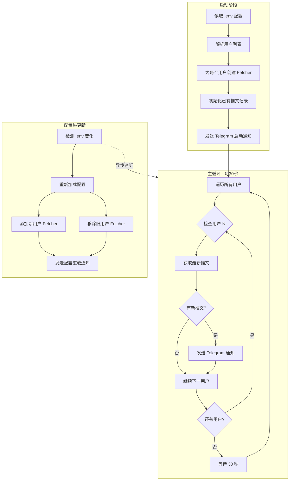

# XWatch - X/Twitter 推文监控器

[](https://www.python.org/)
[](https://www.docker.com/)
[](LICENSE)

实时监控 X (Twitter) 用户的推文，发现新推文时通过 Telegram Bot 发送通知。

## ✨ 功能特点

- 🔍 **实时监控** - 每 30 秒检查目标用户的新推文
- 👥 **多用户支持** - 同时监控多个 Twitter 用户
- 📱 **Telegram 通知** - 新推文即时推送到 Telegram
- 🖼️ **媒体支持** - 图片/视频随推文一起推送
- 🔄 **配置热更新** - 修改配置无需重启程序
- 💾 **状态持久化** - 重启后不重复推送已发送推文
- 🐳 **Docker 支持** - 一键部署到服务器
- 🆓 **免费方案** - 无需 Twitter API 付费订阅

## 🚀 快速开始

### 前置条件

1. **创建 Telegram Bot**
   - 与 [@BotFather](https://t.me/BotFather) 对话，发送 `/newbot`
   - 保存获取的 Bot Token

2. **获取 Chat ID**
   - 与 [@userinfobot](https://t.me/userinfobot) 对话
   - 保存获取的 ID

### 方式一：本地运行

```bash
# 1. 克隆项目
git clone https://github.com/edc3000/XWatch.git
cd XWatch

# 2. 安装依赖
pip install -r requirements.txt

# 3. 配置环境变量
cp .env.example .env
# 编辑 .env 文件，填入你的配置

# 4. 启动程序
python -m src.main
```

### 方式二：Docker 部署（推荐，一键启动，含 RSSHub）

```bash
# 1. 配置环境变量
cp .env.example .env
# 编辑 .env 文件

# 2. 一键启动（含 RSSHub）
docker-compose up -d --build

# 3. 查看日志
docker-compose logs -f
```

> 提示：Docker 模式下 `RSSHUB_BASE_URL` 默认使用 `http://rsshub:1200`（服务名）。

## ⚙️ 配置说明

### 环境变量

| 变量名 | 必填 | 默认值 | 说明 |
|--------|------|--------|------|
| `TWITTER_USERNAMES` | ✅ | - | 监控的用户名，多个用逗号分隔，如 `Vito777_,elonmusk` |
| `TELEGRAM_BOT_TOKEN` | ✅ | - | Telegram Bot Token |
| `TELEGRAM_CHAT_ID` | ✅ | - | Telegram 接收消息的 Chat ID |
| `CHECK_INTERVAL` | ❌ | `30` | 检查间隔（秒） |
| `SEND_EXISTING_ON_START` | ❌ | `false` | 启动时是否发送现有推文 |
| `LOG_LEVEL` | ❌ | `INFO` | 日志级别 |
| `STATE_FILE` | ❌ | `data/seen_tweets.json` | 推文已读状态保存路径 |
| `MIN_USER_INTERVAL` | ❌ | `60` | 每个用户最小抓取间隔（秒） |
| `GLOBAL_MIN_REQUEST_INTERVAL` | ❌ | `2.0` | 全局最小请求间隔（秒） |
| `RATE_LIMIT_BACKOFF_MAX` | ❌ | `300` | 429 最大退避时间（秒） |
| `RSSHUB_ENABLED` | ❌ | `true` | 启用 RSSHub 备用通道 |
| `RSSHUB_BASE_URL` | ❌ | `http://127.0.0.1:1200` | RSSHub 基础地址（Docker 推荐 `http://rsshub:1200`） |
| `RSSHUB_TIMEOUT` | ❌ | `15` | RSSHub 请求超时（秒） |

### 本地运行 + RSSHub

如果你本地运行（非 Docker），请确保 RSSHub 在本机启动，并将 `.env` 中的 `RSSHUB_BASE_URL` 改为：

```
RSSHUB_BASE_URL=http://127.0.0.1:1200
```

### 配置热更新

程序支持配置热更新，修改 `.env` 文件后会自动重新加载配置，无需重启程序。

> **注意**：添加或移除监控用户会在下一个检查周期生效。

## 🔄 工作流程



### 核心流程说明

| 阶段 | 说明 |
|------|------|
| **启动** | 加载配置 → 为每个用户创建独立的抓取器 → 记录现有推文 |
| **监控** | 轮询所有用户 → 发现新推文 → 推送 Telegram |
| **热更新** | 监听 `.env` 变化 → 动态增删用户 → 无需重启 |

## 📁 项目结构

```
XWatch/
├── README.md               # 项目文档
├── Dockerfile              # Docker 镜像构建
├── docker-compose.yml      # Docker Compose 配置
├── .env.example            # 环境变量模板
├── .gitignore              # Git 忽略文件
├── requirements.txt        # Python 依赖
└── src/                    # 源代码
    ├── __init__.py
    ├── main.py             # 主程序入口
    ├── config.py           # 配置管理
    ├── fetcher/            # 推文抓取模块
    │   ├── __init__.py
    │   └── tweet_fetcher.py
    └── notifier/           # 通知模块
        ├── __init__.py
        └── telegram.py
```

## 🛠️ 开发

### 本地开发

```bash
# 安装开发依赖
pip install -r requirements.txt

# 运行程序
python -m src.main

# 测试推文抓取
python -m src.fetcher.tweet_fetcher
```

### Docker 开发

```bash
# 构建镜像
docker-compose build

# 启动服务
docker-compose up

# 停止服务
docker-compose down
```

## 📝 技术说明

本项目使用 Twitter Syndication API 获取推文，这是一个非官方但公开可访问的接口，无需 API 密钥。

> ⚠️ **注意**：由于使用非官方 API，Twitter 可能随时更改或禁用此接口。

## ❓ 常见问题

### 如何更新代码？

如果你修改了 Python 代码（如 `src/` 目录），需要重新构建 Docker 镜像才能生效：

```bash
# 重新构建并启动
docker-compose up -d --build
```

仅修改 `.env` 配置文件**不需要**重新构建，可以自动热更新或重启容器：

```bash
# 重启容器（配置立即生效）
docker-compose restart
```

### 为什么修改代码后重启没生效？

因为 Dockerfile 将代码复制到了镜像中。除非挂载了本地目录映射（开发模式），否则必须运行 `docker-compose up -d --build` 来重新打包镜像。

## 📄 License

MIT License
